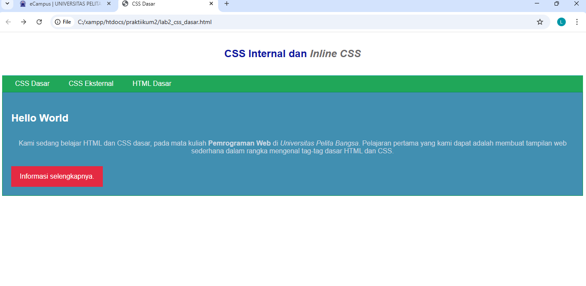
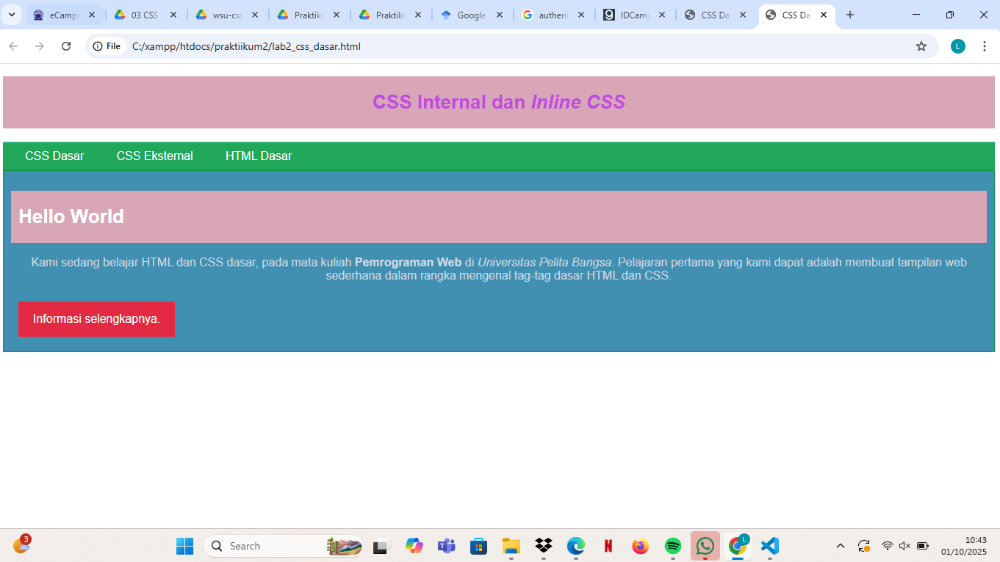
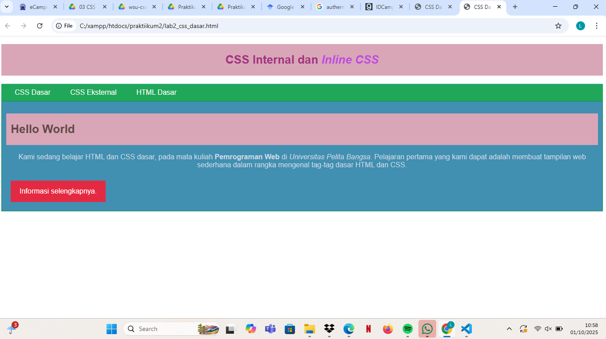

# 🌐 Praktikum 2: CSS Dasar

👤 **Nama**: Leni

   **NIM**: 312410442

🏫 **Kelas**: TI.24.A5

---

## 📂 File yang Digunakan

* 📄 **lab.html** → berisi struktur HTML utama serta deklarasi **internal CSS**.
* 🎨 **style_eksternal.css** → file CSS eksternal yang dipanggil dari `lab.html`.

---

1. Buat file baru dengan nama **lab2_CSS_dasar.html**

2. Membuat dokumen HTML

buka browser untuk melihat hasilnya


3. Kemudian tambahkan deklarasi CSS internal

refresh untuk melihat hasilnya


4. Menambahkan inline css

Kemudian tambahkan deklarasi inline CSS pada tag <p> seperti berikut.

refresh lagi untuk melihat hasilnya


5. Membuat css eksternal

Buatlah file baru dengan nama style_eksternal.css kemudian buatlah deklarasi CSS seperti berikut:


Kemudian tambahkan tag <link> untuk merujuk file css yang sudah dibuat


setelah itu refresh lagi untuk melihat hasilnya


6. Menambahkan css selector

Selanjutnya menambahkan CSS Selector menggunakan ID dan Class Selector. Pada file
style_eksternal.css, tambahkan kode berikut:


simpan dan refresh lagi untuk melihat hasil perubahannya


## 🚀 Jawaban Tugas

### 🔹 1. Eksperimen Mengubah Properti CSS

Deklarasi awal pada elemen `<h1>` di `lab.html`:

```css
h1 {
  font-size: 24px;
  color: #0F189F;
  text-align: center;
  padding: 20px 10px;
}
```

📸 **Tampilan awal**: 

Kemudian saya ubah dengan menambahkan properti baru:

```css
h1 { 
    font-size: 24px; 
    color: #bf4cde; 
    text-align: center; 
    padding: 20px 10px; 
    background-color: #d9a6b7;
} 
```

📸 **Hasil perubahan**: 

✨ **Perubahan yang terlihat**:

* Ukuran teks sedikit lebih besar karena 24-26.
* Warna teks pada css internal berubah pink tua atau keunguan.
* Ada latar belakang abu-abu dengan warna pink muda.

---

### 🔹 2. Perbedaan `h1 {…}` dengan `#intro h1 {…}`

* `h1 {…}` → berlaku untuk **semua elemen `<h1>`**.
* `#intro h1 {…}` → hanya berlaku pada `<h1>` di dalam elemen dengan **id="intro"**.

📌 **Contoh kode**:

```html
<header>
  <h1>CSS Internal dan <i>Inline CSS</i></h1>
</header>

<div id="intro">
  <h1>Hello World</h1>
</div>
```

```css
h1 {
  color: #a33381; 
}
#intro h1 {
  color: #5f4a4a; 
}
```

📸 **Hasil**: 

👉 **Kesimpulan**:

* Judul di `<header>` → **Ungu tua**.
* Judul di dalam `#intro` → **Abu tua**.

---

### 🔹 3. Prioritas CSS (Eksternal, Internal, Inline)

Urutan prioritas CSS:

1. **Inline CSS** (paling kuat 💪).
2. **Internal CSS** (dalam tag `<style>`).
3. **Eksternal CSS** (paling lemah jika konflik).

📌 **Contoh**:

```html
<p style="color: white;">Teks ini Inline CSS</p>
```

```css
/* Internal */
p {
  color: green;
}

/* Eksternal */
p {
  color: red;
}
```

👉 **Hasil**: Teks tetap **putih**, karena inline CSS memiliki prioritas tertinggi.

---

### 🔹 4. Prioritas ID vs Class

Jika elemen memiliki **ID** dan **Class**, maka **ID lebih kuat**.

📌 **Contoh**:

```html
<p id="paragraf-1" class="text-paragraf">
  Ini contoh teks dengan ID dan Class
</p>
```

```css
.text-paragraf {
  color: white;
}
#paragraf-1 {
  color: red;
}
```

👉 **Hasil**: Teks berwarna **merah**, karena selector **ID** lebih spesifik daripada **Class**.

---

## 📝 Kesimpulan

📌 Dari praktikum ini dapat disimpulkan bahwa:

1. CSS dapat memperindah tampilan web dengan berbagai properti.
2. Selector umum (`h1`) berbeda dengan selector spesifik (`#intro h1`).
3. Urutan prioritas CSS adalah: **Inline > Internal > Eksternal**.
4. **ID** memiliki tingkat prioritas lebih tinggi dibandingkan **Class**.

---

